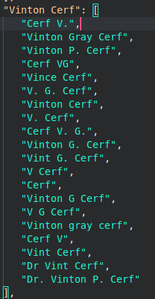

# Collecting domain specific data given a seed set of structured and unstructured sources (Domain: Computer Scientists)

### NOTE: The README only contains a brief explanation. Refer to REPORT for other details.

**Team members (TEAM 6): Anmol Agarwal, Sanchit Arora, Ritvik Garg, Nisarg Seth**

**Link to dashboard where the a sample of the data we collected can be viewed:** [https://ire-team-6.vercel.app/](https://ire-team-6.vercel.app/)

# **Aim of the project:**

The aim of the project is to retrieve and integrate vast amounts of textual data on the internet specific to a particular domain from both structured information sources (like infobox on Wikipedia or [Forbes tables](https://www.forbes.com/billionaires/)) and unstructured sources ( [link to example](https://www.britannica.com/biography/Jeff-Bezos) ). After this, we wish to convert the previously unstructured data to a json file with rows representing “entities” of the chosen domain and columns (key,value pairs) specific to the entity.

# **Choosing a domain**

### **Our aim was to choose a domain satisfies the following criteria:-**

- One which has decent amount of structured and unstructured data
- An already existing proper dataset or compilation does not exist online

## Directory Structure (highlights only the main files ONLY even though other files might be present as well)

```
essential_files/
├── alias_mapping.json
├── FINAL.json
└── INITIAL_WIKI_SEED_NAMES_LIST.json

scrapers_and_crawlers/ # contains all the code written to scrape an crawl


analysis_merging_cleaning/
├── 01 create_mappings_to_other_databases
│   ├── create_EXT_databases_mapping.ipynb   # extracts mapping from wikipedia to different databases
│   ├── dblp_mapping.json
│   ├── google_scholar_mapping.json
│   ├── math_genea_mapping.json
│   ├── VIAF_mapping.json
│   └── world_cat.json


├── 02 explore_wiki_data
│   ├── all_funcs.py   #  [IMP] contains modules to clean the different values
│   ├── all_wiki_attributes_freq_sorted.json  # contains relevant PRELIM attributes from only one DATASET ie wikipedia
│   ├── nice_birth_date_mapping.json # a file showing the decent mapping of DOB using the heuristic
│   ├── nov_explore_wikidata.ipynb  # judging usefulness of attributes in WIKIDATA
│   ├── nov_fetch_aliases.ipynb  #  [IMP] TO CREATE AN ALIAS MAPPING
│   ├── oct_explore_attributes.ipynb
│   ├── purify_functions.py  # [IMP] contains mapping for which attribute needs to be purified how and to which parent
│   ├── test_purify_functions.ipynb  # [IMP] purifies the wikipedia data using purify_functions.py
│   └── useful_attributes.json    # the attributes distribution at the earliest stage


├── 03 reexplore_attributes
│   ├── intro_counter.ipynb  # introducing "data","num_sources" AND "is_reliable"
│   ├── night_attr_analyze.json
│   └── nov_night_analyze_attrs.ipynb


├── 04 purify_all_stuff
│   ├── all_funcs.py #  [IMP] contains modules to clean the different values
│   ├── del_attributes_list.json  # attributes to be deleted due to sparsity or irrelevance
│   ├── oct_create_prelim_wiki_data.ipynb
│   ├── prune_dataframe.ipynb  # [IMP] main code to PRUNE ALL DATA, mapping, merging etc
│   ├── prune_helper.py  # [IMP] helper functions for mapping and merging
│   ├── sample_and_freqs_for_attributes.json # [IMP] final description for all attributes 
│   ├── store_sorted_freqs.ipynb
│   ├── test_names.py       # to find common tokens between two tokens
│   └── update_sorted_stuff.py  


└── 05 plots
    └── plot.ipynb

```

# Datasets identified and used

All code can be found in the **“scrapers and crawlers”** directory of the repo.

## WIKIPEDIA

### **Step 1: Finding a list of people**

Via simple google search, we identified pages from where we can get a list of Computer Scientists on Wikipedia. We found that all computer scientists have not been covered in the main list (ie [https://en.wikipedia.org/wiki/List_of_computer_scientists](https://en.wikipedia.org/wiki/List_of_computer_scientists) ). We found that there were some scientists which were exclusively present in some particular list: Eg: **Prof PJ Narayanan** is present in [“Indian Computer Scientists”](https://en.wikipedia.org/wiki/Category:Indian_computer_scientists) but **not** in the main list. Also, some scientists are exclusively present in “subarea specific lists” like for [Machine Learning](https://en.wikipedia.org/wiki/Category:Machine_learning_researchers) , [Database Researchers](https://en.wikipedia.org/wiki/Category:Database_researchers) etc.

**code :** in folder “identify_people_on_wikipedia” in the repo

**list :** wiki_data_people_names.txt

### **Links to get names of potential computer scientists:**

- https://en.wikipedia.org/wiki/List_of_computer_scientists
- https://en.wikipedia.org/wiki/Category:Computer_scientists
- https://en.wikipedia.org/wiki/Category:Indian_computer_scientists
- https://en.wikipedia.org/wiki/Category:Indian_women_computer_scientists
- https://en.wikipedia.org/wiki/Category:American_computer_scientists
- https://en.wikipedia.org/wiki/Category:Theoretical_computer_scientists
- https://en.wikipedia.org/wiki/Category:Artificial_intelligence_researchers
- https://en.wikipedia.org/wiki/Category:Machine_learning_researchers
- https://en.wikipedia.org/wiki/Category:Coding_theorists
- https://en.wikipedia.org/wiki/Category:Computer_security_academics
- https://en.wikipedia.org/wiki/Category:Computational_linguistics_researchers
- https://en.wikipedia.org/wiki/Category:Cryptographers
- https://en.wikipedia.org/wiki/Category:Database_researchers
- https://en.wikipedia.org/wiki/Category:Researchers_in_distributed_computing
- https://en.wikipedia.org/wiki/Category:Computer_graphics_researchers
- https://en.wikipedia.org/wiki/Category:Computer_hardware_researchers
- https://en.wikipedia.org/wiki/Category:Human%E2%80%93computer_interaction_researchers
- https://en.wikipedia.org/wiki/Category:Information_retrieval_researchers
- https://en.wikipedia.org/wiki/Category:Information_systems_researchers
- https://en.wikipedia.org/wiki/Category:Information_theorists
- https://en.wikipedia.org/wiki/Category:Information_visualization_experts
- https://en.wikipedia.org/wiki/Category:Programming_language_researchers
- https://en.wikipedia.org/wiki/Category:Quantum_information_scientists
- https://en.wikipedia.org/wiki/Category:Scientific_computing_researchers
- https://en.wikipedia.org/wiki/Category:Social_computing_researchers
- https://en.wikipedia.org/wiki/Category:Software_engineering_researchers
- https://en.wikipedia.org/wiki/Category:Software_testing_people
- https://en.wikipedia.org/wiki/Category:Computer_systems_researchers
- https://en.wikipedia.org/wiki/Category:Theoretical_computer_scientists
- https://en.wikipedia.org/wiki/Category:Ubiquitous_computing_researchers
- https://en.wikipedia.org/wiki/Category:Computer_vision_researchers

### **STEP 2: Fetching the pages for people in the list**

We used the “wptools” library and extracted all possible data .

We studied the meanings of the attributes [here](https://github.com/siznax/wptools/wiki/Data-captured) and shortlisted the important ones.

To get a brief idea about density of attributes, we sorted attributes by frequency across articles.

**Number of unique people after merging people across all above links:** 3254

### **STEP 3: Making a new file with only the useful attributes (mainly derived from “wikidata” and “infobox”)**

I manually inspected the file “wikidata_attributes.json” and decided to keep only those attributes which are not very sparse. Also, I decided to keep person IDs of the person on popular sites as attributes as well, as such attributes can come in handy while scraping data (Eg: the Google Scholar ID stored helped us directly scrape data from the author’s Google Scholar page instead of first searching for the page using person name). I removed not so useful attributes like “"Guggenheim fellows ID”.

### **How is this helpful ?**

The most comprehensive dataset which served as the seed for us in some way. Has wide range of attributes:-

- Personal like DOB, place of birth, languages spoken
- Family related like spouse(s), mother name, children
- Job related like “areas of interest”, “doctoral advisor”
- Others like “awards received”, “associated universities and companies”
- IDs for the person used by other databases like “WorldCat”,”dblp”

## research.com

### **This site had 2 things:**

- A list of people
- Individual profiles of the people ( Eg: for Hinton : [link](https://research.com/u/geoffrey-hinton) )

We scraped data from both types of pages.

### **It was helpful to fetch the following attributes:**

- Name
- Ranking
- H-index (this might be outdated so we use the value we derive from Google Scholar instead)
- Number of publications
- Link for Google Scholar profile
- Link to personal website
- Number of aggregate citations
- Link to photograph
- Associated organization
- Awards won

Number of people found: 997

## Google Scholar

### **While getting data from Google Scholar, we encountered 3 types of people:**

- **Type 1:** People for whom we already had the Google Scholar Profile Link **(from dataset from “research.com”)**
- **Type 2:** People whose Google Scholar ID was known **from Wikidata**
- **Type 3:** People with no existing mapping

For people of **type 3**, we applied the following method to find data:

Since the SERP API had a query rate limit, we use **traditional methods** instead. We search for the person’s name on this link ([https://scholar.google.com/](https://scholar.google.com/) ) and take the following actions:

- **Case 1:** 0 profile results = we conclude person does not have a Google Scholar page
- **Case 2:** exactly 1 profile result: we are able to find the link to his Google Scholar page
- **Case 3:** more than 1 profile result shows up, we choose the person with max total citations but we also mark the result as “yet to be verified”

> 
> 
- In future, we try to resolve case #3 as follows: Let’s say you want to find the Google Scholar page for person P of organization C [we know the organization from Wikipedia infobox]. Let profile results for person P have the following “associated organizations” ie C1, C2, …, C_n. In such a case we try to find ‘i’ such that C_i=C. If multiple such ‘i’ exist, then we try to match publications instead. Since it is highly unlikely that 2 people with the same name are authors on a paper, our method is bound to be successful.


### **While scraping, we encountered two difficulties and applied these hacks/heuristics to overcome them:**

- After fetching a few profiles, we get **Captcha**

Whenever we get a Captcha, we go to google.com (just to change the website, we can go to any other website also) and sleep for 30 seconds. We repeat this process until the Captcha is gone.

- To get all the publicationsers, we have to **click the Show More** button again and again.

For clicking, we simply use the **Selenium driver**. Now, while loading new data the button becomes disabled and after getting the data it is enabled again (if more data is there to fetch). So, we know that latest data is fetched if one of these two things happen:

1. the Show More button is not disabled or
2. We have checked this for 5 seconds (depending on internet speed) and it's still disabled, this means that the latest data is here, but there is no more data to fetch.

Other than this, there are times when the button just disappears while loading and gives server error, sometimes temporary and sometimes permanent. To avoid getting stuck in an infinite loop, we limit clicking on the button to 50 times.

### **We are able to fetch the following attributes:**

- Affiliation
- An image URL
- Link to personal website
- Areas of interest
- H-index
- i10-index
- citations overall
- List of publications each with the following attributes:
    - Name
    - Conference
    - List of authors
    - Number of citations
    - Year of publishing

**Number of people:** 1800

## dblp ( )

### **There were 2 tasks here:**

- **Task 1:** To identify the profile page for a person P using dblp search API. If there were multiple results being returned, we used a heuristic (described below) to find the appropriate result
- **Task 2:** To fetch data from the person’s page

Eg page for Hinton: [https://dblp.org/pid/10/3248.html](https://dblp.org/pid/10/3248.html)

Number of unique people: 2600 (approx)

### **We were able to find the following attributes:-**

- Affiliation
- Awards (for some people)
- List of publications
- List of articles, journals
    - Co-author list
    - Link to paper
    - Title
    - Year
- List of co-authors for person P
- List of conferences where P has published

## Semantic Scholar

### **There were 2 tasks here:**

Eg page for PK: [https://www.semanticscholar.org/author/P.-Kumaraguru/1734731](https://www.semanticscholar.org/author/P.-Kumaraguru/1734731)
Number of unique people: 115 (approx)

### **Since we already had publication related attributes from dblp and scholar, we extracted only new attributes from here:-**

- Authors most influenced by this scientist
- Authors this computer scientists is most influenced by


## Best Schools Org ( )

**Number of people:** 56

### **Attributes found:**

- Areas of interest
- General biography summary
- Academic website
- List of “few” books written
- Image of the person

## famouspeople.com ()

**Number of people:** 326

### **Attributes found:**

- Short reason for why the person is a “famous” computer scientist
- date of birth
- place of birth
- sun sign
- Date of death (if applicable)
- A picture of the person

## PANTHEON ()

**Number of people:** 201

### **Attributes found:-**

- Date,place,latitude, longitude of birth
- Date,place,latitude, longitude of death
- Wikipedia language editions
- Historical Popularity Index (as per Pantheon)
- Coefficient of variation in Wikipedia pageviews
- Non-English wikipedia pageviews in past 6 months

## Mathematics Genealogy Project ()

Number of people: 1362

Sample: [https://www.mathgenealogy.org/id.php?id=65084](https://www.mathgenealogy.org/id.php?id=65084) for Eric Demaine

### **Attributes found:-**

- Advisor name
- Educational qualifications with institutes
- Dissertation Title
- Exhaustive list of students

## Academic Influence ()

We find that pages on this website have **more than 20k entries** [Each page has 50 entries and there are more than 400 pages]. This is because this website contains most people in academia related to CS [We were able to find Prof PK and Prof Anoop from our college on this website as well].

**[FINALLY NOT INTEGRATED : this dataset would have enabled us to get many extra rows but with a very few filled columns for a person like Prof Anoop. To maintain the density of the data, we abandoned this dataset].**

## WorldCat catalog ()

**Eg:** page for Geoffrey Hinton: [link](http://www.worldcat.org/identities/lccn-n80165215/)

**Number of people found:** 1932

### **Method:**

I was able to find the “WorldCat Identity ID” for 1932 people in the **wikidata** and hence, was able to directly find their profile pages in the WorldCat catalog. Then, I simply scraped the useful data.

### **Useful attributes found:-**

- Works/books “about” the person
- Works/books “authored by” the person
- Subjects which can be associated with the person
- Entities related to the person
- Roles person plays in real life
- Genres person is involved in

## Wikiquote

## Eg: page for Taenbaum: [link](https://en.wikiquote.org/wiki/Andrew_S._Tanenbaum)

### **Method:**

I was able to find the “wikiquote url” for people in the **wikidata** and hence, was able to directly find their profile pages. Then, I simply scraped the useful data.

### **Useful attributes found:-**

- Different quotations by the author

## VIAF (Virtual International Authority File)

## Eg: page for Taenbaum: [link](https://viaf.org/viaf/108789370/)

Number of people: 2157

### **Method:**

I was able to find the “person VIAF ID” for people in the **wikidata** and hence, was able to directly find their profile pages. Then, I simply scraped the useful data.

### **Useful new attributes found:-**

- Companies who have published works by the person with frequency

> 
> 
- List of regions where work has been published/distributed

> 
> 
- A heat map depicting the different regions where the work is read (we have stored the image as a URL)

> Sample image below:
> 


# Attributes List

## List of attributes in the final database with short descriptions (some attributes are very sparse, but I still have not removed them)

**NOTE: the list below is sorted by frequency and NOT by importance**

The number in bracket is the number of rows where the attribute is present:

- ire_person_name (4128)
    - Although a person may have many different aliases/versions of the same name (Eg: [MS Dhoni, Dhoni, Mahendra Dhoni etc], we choose just one of them to be present as the ire_person_name)
- ire_wiki_id (4128)
    - This is an artificial ID generated by us for each row which was useful for us while merging data collected from different sources
- wikipedia_page_url (3469)
    - The meaning of this attribute is self-explanatory. In case our data is used for text-summarization for each row, then a hyperlink “READ MORE here” linking to the wikipedia page of the person in the row may be desirable.
- person_name (3469)
    - This contains a list of names/aliases a person can be known by:-
        - It was generated using the original name and other attributes in wikidata like “redirects”, “birth name”, “family_name”,”pseudonym” and “aliases”.
        - This turned out to be very helpful for us to merge databases which were not linked directly to Wikipedia using some ID. (Eg: “research.com”, some entries in the “dblp_dataset”)
        - Eg:
            
            
            
- backlinks_to_other_wiki_pages (3469)
    - list of pages on WIkipedia that link to this person
    - On inspection, we found that such pages have their headings as both people and concepts.
    - For eg: for Abraham Silberschatz (the person who wrote the textbook we study in our OS course), the linked pages had headings like “memory management”,”Two-phase locking" and people like "C. Mohan".
    - We kept this attribute as later, it can help us identify whether a person is indirectly connected to some other person/concept (within the same connected component) with the backlinks being directed edges.
- wikipedia_categories_associated_with (3469)
    - This attribute contains important categories of which the person is a part of (alumni/faculty list of some university etc). Eg categories can be "Yale University faculty", "Stony Brook University alumni".
    - We kept this attribute as it can help us group people of different categories for queries like “SHOW ME ALL people who are currently faculty of X university”
- wiki_pages_accessible_from_person_wiki_page (3468)
    - This is the same as “backlinks to a wikipedia page” with the edge in reverse direction.
- person_gender (3425)
- employer_orgs (3415)
    - This contains a combination of values from many fields in wikidata (like “affiliation”,”workplace”, “employer”,”work_institutions”) and also from values derived from other databases like the top line present in Google Scholar page.

> 
> 
- person_job (3360)
    - This just specifies the list of occupations the person might identify with like “engineer”, “computer scientists”, “entrepreneur” etc
- institutions_educated_in (3020)
    - This was formed using a combination of fields like “education”, “educated at” , “alma_mater”. It contains colleges, boarding schools etc. Duplicates were removed using a heuristic.
- dblp_url_use (2847)
    - Contains the dblp profile page URL of the person.
- dblp_co_authors (2847)
    - Contains the list of all the registered people who have partnered with a person in any work like “publication”,”journal”,”book” etc
- dblp_publications (2847)
    - Contains exhaustive list of books, articles, journals, papers authored by the person with several nested attributes like:-
        - title of work
        - year of publishing
        - page number location (in case of articles)
        - list of all authors of the work
        - URL where the work can be accessed
    - 
        
        
        
- person_dob (2657)
    - Contains a dictionary with 3 attributes : day, month and year.
    - This attribute was present in almost all sources and hence, we were able to provide several consistency checks using a heuristic mentioned below.
- country_of_citizenship (2510)
- Freebase ID (2484)
- dblp_other_urls (2304)
    - Contains a large number of URLs present on the dblp page linked to the person .
    - We did not merge it in some other attribute as there was tough to detect what the URLs were actually (some were links to twitter profiles, some were academic webpage of the person etc)
- awards_won_by_person (2196)
    - Has medals, awards, prizes and other honours. Data is mainly derived from wikidata and “research.com”.
- viaf_list_of_publishers (2157)
    - Contains a list of publishers who have published a work by the person in the past along with frequency.
- viaf_list_of_publication_regions (2157)
    - explained above in dataset section
- person_domains (2117)
    - contains areas/branches with which the person is associated. Has sub-CS disciplines like Robotics, Cryptography, Vision etc
- WorldCat Identities ID (1998) : simple mapping to WorldCat database
- associated_website (1969)
    - contains the personal webpage link of the person. Mainly derived from wikidata attributes like “website”,’official_website’,”described_at” , BestSchool.com and the top section of Google Scholar website.
    - 
        
        
        
- viaf_pubs_map_image (1943)
    - explained above in dataset section
- books_and_works_by_person (1932)
    - This almost has all data derived from “worldcat.org”. It contains a detailed description about the books and works by the person.
- Library of Congress authority ID (1878) : Simple mapping to an external database
- wc_related_entities (1866)
    - contains people/concept in the WorldCat database which are linked to this person (can be used to see if 2 entities belong to same connected component)
- wc_associated_subjects (1848)
    - Some buzzwords with which the person can be associated with (found in WorldCat database)
- doctoral advisor(s) (1822)
    - Was derived using attributes “student of”, “doctoral advisor”, “academic advisor” of wikidata and from the “MATH GENEALOGY PROJECT ”
    - 
        
        
        
- description (1809)
- person_birth_place (1789)
- Mathematics Genealogy Project ID (1432)
- mgp_dissertation (1429)
    - person’s dissertation as mentioned on “MATH GENEALOGY PROJECT ”
- person_doctoral_students (1230)
    - list derived from wikidata attributes like “student”,”doctoral students”, “notable students” and from “MATH GENEALOGY PROJECT ”. Some people also have sub-attributes like in which institution was the student-advisor relationship established and in what year (derived using “MATH GENEALOGY PROJECT ”)
    - 
        
        
        
- person_image_links (1189)
    - links to images from Wikipedia, Google scholar profile image etc
- person_nationality (1056)
- languages spoken, written or signed (997)
- gs_profile_url_using_research_com (989)
- Google Scholar author ID (929)
- member of (914)
    - contains organizations like IEEE, ACM etc
- gs_Citations (873) : citations as per google scholar
- gs_h-index (873) [as per google scholar]
- gs_i10-index (873) [as per google scholar]
- gs_title (873) [one line description written in Google Scholar]
    - 
        
        
        
- gs_publications (873)
    - current publications as per Google Scholar with sub-attributes for each publication like;-
        - title
        - url to work
        - authors
        - which conference
        - how many citations yet
        - link to lists of papers citing it
- person_thesis (721)
- thesis_year (671)
- person_residence (578)
- works_about_person (563)
- person_date_of_death (547)
    - same cleaning and consistency checking process as data of birth
- thesis_url (429)
- person_notable_work (288)
- person_place_of_death (286)
- person_spouse(s) (269)
- Twitter username (259)
- person_children (190)
- academic degree (178)
- wikiquotes (169)
    - list of quotations by the person derived from the WIKIQUOTE website
- work location (138)
- person_death_causes (124)
- Semantic Scholar author ID (117)
- people_who_most_influenced_the_person_publicationwise (115)
    - from semantic scholar
- people_who_were_most_influenced_by_person_publicationwise (115) : calculated by semantic scholar algorithms
- LinkedIn personal profile ID (114)
- person_influenced_by (101)
- position held (98)
- person_parents (93)
- person_has_influenced (87)
- religion (64)
- participant in (62) # contains conferences, chess tournaments etc
- ethnic group (52)
- sibling (45)
- GitHub username (41)
- Fellow of the Royal Society ID (41)
- years_active (38)
- place of burial (37)
- number of children (21)
- official blog (20)
- medical condition (14)

## 3 types of databases encountered

We dealt with 3 types of data sources:-

- Type A: seed dataset
    - Wikipedia
- Type B: datasets inspired from Wikipedia (with mapping possible using ire_wikipedia_id)
    - Wikiquote
    - Google Scholar
    - WorldCat ID
    - Math Gaenalogy Project
    - etc
- Type C: independent datasets which need heuristics to be mapped to Wikipedia
    - FamousPeople.com
    - BestSchools.org
    - Pantheon
    - Research.com

# Pipeline followed

## To summarize, in general, our path is as followed:

- Create an initial seed using the wikipedia data
- Taking IDs of common databases (Type B) like dblp, semantic scholar from wikidata and then using these IDs
- For databases like DBLP, where search was easy, we crawled the details of those people using the search bar as well
- Write **scrapers and crawlers** for databases in both categories B and C
- We then cleaned each of the individual datasets first (applicable to all 3 types of datasets: A, B, C)
- Now, there were 2 sub-tasks:
    - **Subtask T1:** Mapping rows in databases of type B and C to type A
    - **Subtask T2:** After mapping, merging and performing consistency checks for attributes present in more than one database
        - Eg: if database D1 mentions person won award A1 and database D2 mentions person won award A2; then we take union of A1 and A2
        - Eg: if database D1 mentions person was born on B1 and database D2 mentions person was born on B2; then we need to check if B1 and B2 are not contradicting each other. Eg: if B1= 4th July, 1972 and B2 = July, 1972; then they are consistent. If not consistent, I flag the attribute by setting “is_reliable” as False but I retain the value specified by WIKIPEDIA (higher priority).
- If, during subtask T1, we were not able to find a mapping, then we add a new row to the database

## Maintaining consistency and confidence scores

- For each columns there are 2 (or 3) features stored:
    - **data :** values of the feature
    - **number of sources :** number of sources via which the value was verified
    - **is_reliable :** if there was a contradiction, then we mark this field as False (all fields are not eligible for contradiction, ) [this field is present for a few attributes like DOB only]


**Preprocessing, cleaning and extracting useful information**

- Some of the functions used for pre-processing can be found in the file **“all_funcs.py”.**
- Whether a pre-processing function should be applied to an attribute at all depends on its state in the dictionary in **“purify_functions.py”. Sample shown in below image:-**
    - 
        
        
        
    - **Interpretation:** Values for attribute “death_date” should be passed through function “purify_birth_date” and the purified value should finally be stored in an attribute “person_date_of_death”.
    - Many child attributes like “death_date”, “date of death” etc had the same parent_attribute

**I mention some of the attributes which needed pre-processing and how it was done:-**

- Discarding useless backlinks like the ones in the image below:-
    - 
        
        
        
    - For words like “talk”,”archive”,”file” etc, we considered it to be a useless backlink.
- Removing the “category” prefix from categories like "Category:American computer scientists".
- Removing Wikidata IDs from attribute names (occupation (P106)) and attribute values ("computer scientist (Q82594)") using REGEX.
- Converting all date formats to a common date format for comparison and consistency checks.
    - Possible input formats:

> 
> 
> 
> Output format:
> 
> 
> 
- Extracting elements of a list from a single string separated by [[]], {{}}, <br/> using several techniques like **regex, balanced brackets** etc for attributes like Birthplace, employers, nationality, interests etc using function “purify_known_for()”:
    - Different Input formats possible:
        
        
        
- etc

# Mapping and merging (Subtasks T1 and T2) in addition to checking consistency via different data sources

**Majority of helper functions in “test_names.py” and “prune_helper.py”**

- I had to often check whether two terms W1 and W2 are equal or not.
    - This was needed for tasks like:-
        - Mapping “Vincent C Cerf” to “V C Cerf”
        - Removing duplicates introduced as a result of taking union for same attribute from different sources (Eg: I got doctoral advisors from several sources and had to remove duplicates):
            - Input: [“Rahul Dravid”, “Sachin Tendulkar”, “Sachin R. Tendulkar ”]
            - Output: [“Rahul Dravid”, “Sachin R. Tendulkar ”]
    - I used the following heuristic to achieve it:
        - Change W1 and W2 to lowercase
        - Remove all characters except alphabets and space
        - Tokenize W1 and W2 by space
            - Eg: Tokens for W1 (arr1) = [sachin,tendulkar] , Tokens for W2 (arr2) = [sachin,r, tendulkar] ,
        - Check if either of the arrays is a subset of the other and assign score S as follows:
            - If yes, assign infinite score
            - If no, then assign score S as number of elements in intersection of arr1 and arr2
        - Decide a threshold T such that:
            - if S>=T, conclude W1 and W2 represent same thing
            - If S<T, conclude W1 and W2 are different
        - For mapping rows, I kept threshold as 1000 (to signify infinite score as the only acceptable case)
        - For duplicate removal while union, I kept threshold as 2 or 3
- Checking consistency for dates like DOB present from various sources:
    - Each date is a 3 tuple: <year, month, day>.
    - If number of unique values among all DOBs for each year, month, day <=1 (0 is also a possibility in case “month” is None for all) ; then I assume the value to be consistent
    - If the above does not hold, I mark the attribute value as unreliable but still keep the value predicted by Wikipedia (likely to be most reliable)
- Making sure that websites like “[https://www.iiit.ac.in/~anmol](https://www.iiit.ac.in/~anmol)” and “[www.iiit.ac.in/~anmol](https://www.iiit.ac.in/~anmol)/” are marked as duplicates using regex based cleaning and checking whether one is a substring of another
- Several MORE present in the files “test_names.py” and “prune_helper.py”

# Stats

- Total number of rows after the entire pipeline: 4128
- Total number of columns before the pipeline: **more than 120**
    - The number reduced significantly due to:-
        - Several attributes like “wikipedia_pageid” were deleted
        - Several attributes mapped to one common parent (like death_date and date of death)
- Total number of columns after the entire pipeline: **81 (not all are dense)**
- Final submission can be found in **“final.json”**

Attributes sorted by frequency in the rows can be found in **analysis_merging_cleaning/04 purify_all_stuff/sample_and_freqs_for_attributes.json.**

Fig 1: We can see that most of the rows have a decent quantity of attributes. Before the pre-processing and cleaning, the rows in general had much more attributes due to several attributes being counted twice despite having the same meaning.


Fig 2: We see that a decent percentage of the attributes are present in less than 1000 cols.

However, in general , more attributes are present in a higher number of rows as present during pre-processing. This is because initially “DOB” is present in 2 rows and date of birth is present in 3 rows; then after the pipeline , the parent attribute “person_DOB” is present in union of (2 rows + 3 rows) >= 2.

**FINAL SUBMISSION PATH:** essential_files/FINAL.json

## Link to video

[https://drive.google.com/file/d/1Q9Bp3gza038j4XC49wBM67-lNQxXc-q0/view?usp=sharing](https://drive.google.com/file/d/1Q9Bp3gza038j4XC49wBM67-lNQxXc-q0/view?usp=sharing)